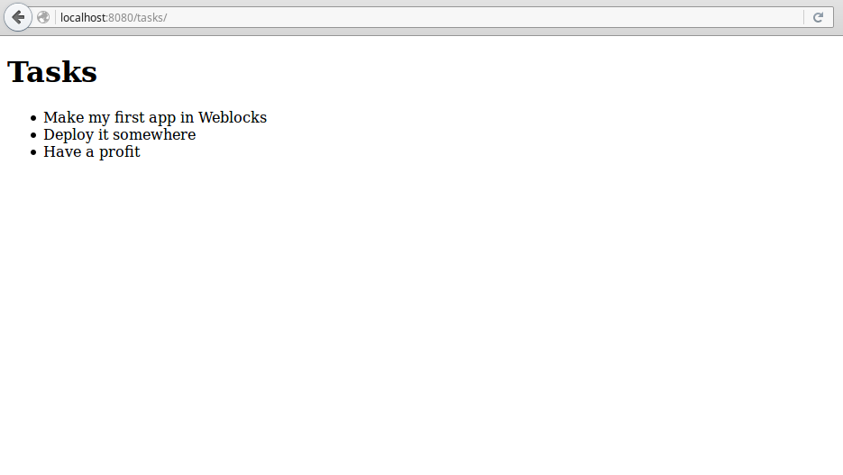
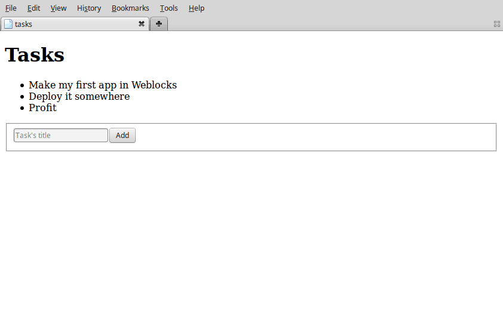

============
 Quickstart
============

.. warning:: This version of Weblocks is not in Quicklisp yet. To
             install it you need to clone the repository somewhere where
             ASDF will find it, for example, to the ``~/common-lisp/`` directory.

Load weblocks and create a package for a sandbox:

.. code-block:: common-lisp-repl

   CL-USER> (ql:quickload '(:weblocks :weblocks-ui :find-port))
   CL-USER> (defpackage todo
              (:use #:cl
                    #:weblocks-ui/form
                    #:weblocks/html)
              (:import-from #:weblocks/widget
                       #:render
                       #:update
                       #:defwidget)
              (:import-from #:weblocks/actions
                       #:make-js-action)
              (:import-from #:weblocks/app
                       #:defapp))
   #<PACKAGE "TODO">
   CL-USER> (in-package todo)
   #<PACKAGE "TODO">

Now, create an application:

.. code-block:: common-lisp-repl

   TODO> (defapp tasks)
   TODO> (weblocks/debug:on)
   TODO> (defvar *port* (find-port:find-port))
   TODO> (weblocks/server:start :port *port*)
    <INFO> [19:41:00] weblocks/server server.lisp (start) -
     Starting weblocks WEBLOCKS/SERVER::PORT: 40000
     WEBLOCKS/SERVER::SERVER-TYPE: :HUNCHENTOOT DEBUG: T
    <INFO> [19:41:00] weblocks/server server.lisp (start-server) -
     Starting webserver on WEBLOCKS/SERVER::INTERFACE: "localhost"
     WEBLOCKS/SERVER::PORT: 40000 DEBUG: T
    #<SERVER port=40000 running>
    (NIL)

Open `<http://localhost:40000/tasks/>`_ in your browser (double check the port) and you'll see a
text like that::

  No weblocks/session:init method defined.
  Please define a method weblocks.session:init to initialize a session.

  It could be something simple, like this one:

  (defmethod weblocks/session:init ((app tasks))
              "Hello world!")

  Read more in the documentaion.

It means that you didn't write any code for your application. Let's do
it now and make an application which outputs a list of tasks.

In the end, we'll build the mandatory TODO-list app:

.. image:: _static/quickstart-check-task.gif
   :align: center
   :alt: the TODO-list app in Weblocks.

The Task widget
===============

.. code-block:: common-lisp-repl

   TODO> (defwidget task ()
           ((title
             :initarg :title
             :accessor title)
            (done
             :initarg :done
             :initform nil
             :accessor done)))

This code defines a task widget, the building block of our
application. ``defwidget`` is similar to Common Lisp's ``defclass``,
in fact it is only a wrapper around it. It takes a name, a list of
super-classes (here ``()``) and a list of slot definitions.

We can create a task with ``make-instance``:

.. code-block:: common-lisp-repl

   TODO> (defvar *task-1* (make-instance 'task :title "Make my first Weblocks app"))
   TODO> *task-1*
   #<TASK {1005406F33}>

Above, ``:title`` is the initarg, and since we didn't give a ``:done``
argument, it will be instanciated to its ``:initform``, which is ``nil``.

We defined accessors for both slots, so we can read and set them easily:

.. code-block:: common-lisp-repl

   TODO> (title *task-1*)
   "Make my first Weblocks app"
   TODO> (done *TASK-1*)
   NIL
   TODO> (setf (done *TASK-1*) t)
   T

We define a constructor for our task:

.. code-block:: common-lisp-repl

    TODO> (defun make-task (title &key done)
            (make-instance 'task :title title :done done))

It isn't mandatory, but it is good practice to do so.

If you are not familiar with the Common Lisp Object System (CLOS), you
can have a look at `Practical Common Lisp <http://www.gigamonkeys.com/book/object-reorientation-classes.html>`_
and the `Common Lisp Cookbook <https://lispcookbook.github.io/cl-cookbook/clos.html>`_.

Now let's carry on with our application.

The Tasks-list widget
=====================

Below we define a more general widget that contains a list of tasks,
and we tell Weblocks how to display them by *specializing* the
``render`` method for our newly defined classes:

.. code-block:: common-lisp-repl

    TODO> (defwidget task-list ()
            ((tasks
              :initarg :tasks
              :accessor tasks)))

    TODO> (defmethod render ((task task))
            "Render a task."
            (with-html
                  (:span (if (done task)
                             (with-html
                                   (:s (title task)))
                           (title task)))))

    TODO> (defmethod render ((widget task-list))
            "Render a list of tasks."
            (with-html
                  (:h1 "Tasks")
                  (:ul
                    (loop for task in (tasks widget) do
                          (:li (render task))))))

The ``with-html`` macro uses
`Spinneret <https://github.com/ruricolist/spinneret/>`_ under the hood,
but you can use anything that outputs html.

We can check how the generated html looks like by calling ``render`` in the REPL:

.. code-block:: common-lisp-repl

    TODO> (render *task-1*)
    
Make my first Weblocks app
    

    NIL

But we still don't get anything in the browser.

.. code-block:: common-lisp-repl

    TODO> (defun make-task-list (&rest rest)
                 "Create some tasks from titles."
                 (loop for title in rest
                       collect (make-task title)))

    TODO> (defmethod weblocks/session:init ((app tasks))
             (declare (ignorable app))
             (let ((tasks (make-task-list "Make my first Weblocks app"
                                          "Deploy it somewhere"
                                          "Have a profit")))
               (make-instance 'task-list :tasks tasks)))

This defines a list of tasks (for simplicity, they are defined as a
list in memory) and returns what will be our session's root widget..

Restart the application:

.. code-block:: common-lisp-repl

   TODO> (weblocks/debug:reset-latest-session)

Right now it should look like this:

Adding tasks
============

Now, we'll add some ability to interact with a list – to add some tasks
into it, like so:

Import a new module, ``weblocks-ui`` to help in creating forms and other UI elements:

.. code-block:: common-lisp-repl

   TODO> (ql:quickload "weblocks-ui")
   TODO> (use-package :weblocks-ui/form)

Write a new ``add-task`` method and modify the ``render`` method of a
task-list to call ``add-task`` in response to ``POST`` method:

.. code-block:: common-lisp-repl

    TODO> (defmethod add-task ((task-list task-list) title)
            (push (make-task title)
                  (tasks task-list))
            (update task-list))
            
    TODO> (defmethod render ((task-list task-list))
            (with-html
              (:h1 "Tasks")
              (loop for task in (tasks task-list) do
                (render task))
              (with-html-form (:POST (lambda (&key title &allow-other-keys)
                                             (add-task task-list title)))
                (:input :type "text"
                        :name "title"
                        :placeholder "Task's title")
                (:input :type "submit"
                        :value "Add"))))

    TODO> (weblocks/debug:reset-latest-session)

The method ``add-task`` does only two simple things:

- it adds a task into a list;
- it tells Weblocks that our task list should be redrawn.

This second point is really important because it allows Weblocks to render
necessary parts of the page on the server and to inject it into the HTML DOM
in the browser. Here it rerenders the task-list widget, but we can as well ``update``
a specific task widget, as we'll do soon.

We are calling ``add-task`` from a lambda function to catch a
``task-list`` in a closure and make it availabe when weblocks will
process AJAX request with ``POST`` parameters later.

Another block in our new version of ``render`` of a `task-list` is the form:

.. code-block:: common-lisp

   (with-html-form (:POST #'add-task)
      (:input :type "text"
       :name "task"
       :placeholder "Task's title")
      (:input :type "submit"
       :value "Add"))

It defines a text field, a submit button and an action to perform on
form submit.

.. note:: This is really amazing!

          With Weblocks, you can handle all the business logic
          server-side, because an action can be any lisp function, even an
          anonymous lambda, closuring all necessary variables.

Restart the application and reload the page. Test your form now and see in a
`Webinspector`_ how Weblocks sends requests to the server and receives
HTML code with rendered HTML block.

Now we'll make our application really useful – we'll add code to toggle the tasks' status.

Toggle tasks
============

.. code-block:: common-lisp-repl

    TODO> (defmethod toggle ((task task))
            (setf (done task)
                  (if (done task)
                      nil
                      t))
            (update task))

    TODO> (defmethod render ((task task))
            (with-html
              (:p (:input :type "checkbox"
                :checked (done task)
                :onclick (make-js-action
                          (lambda (&key &allow-other-keys)
                            (toggle task))))
                  (:span (if (done task)
                       (with-html
                             ;; strike
                             (:s (title task)))
                     (title task))))))

We defined a small helper to toggle the ``done`` attribute, and we've
modified our task rendering function by adding a code to render a
checkbox with an anonymous lisp function, attached to its
``onclick`` attribute.

The function ``make-js-action`` returns a Javascript code, which calls
back a lisp lambda function when evaluated in the browser.  And
because ``toggle`` updates a Task widget, Weblocks returns on this
callback a new prerendered HTML for this one task only.

What is next?
=============

As a homework:

1. Play with lambdas and add a "Delete" button next after
   each task.
2. Add the ability to sort tasks by name or by completion flag.
3. Save tasks in a database (the `Cookbook <https://lispcookbook.github.io/cl-cookbook/databases.html>`_ might help).
4. Read the rest of the documentation and make a real application, using the full
   power of Common Lisp.

.. _Webinspector: https://developers.google.com/web/tools/chrome-devtools/inspect-styles/
